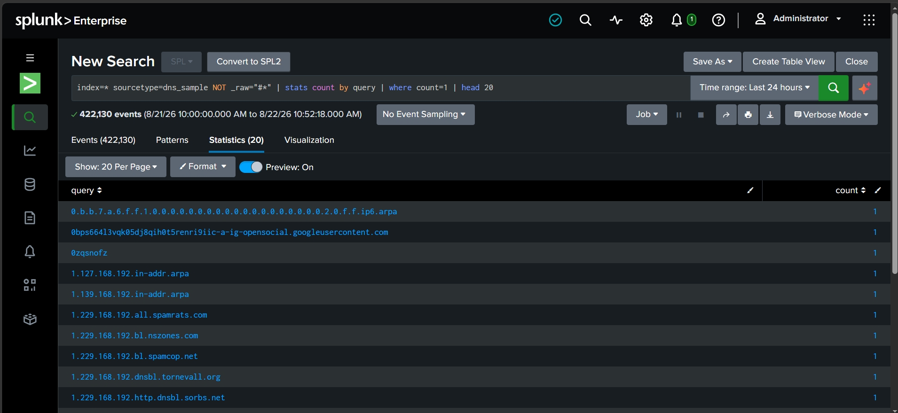
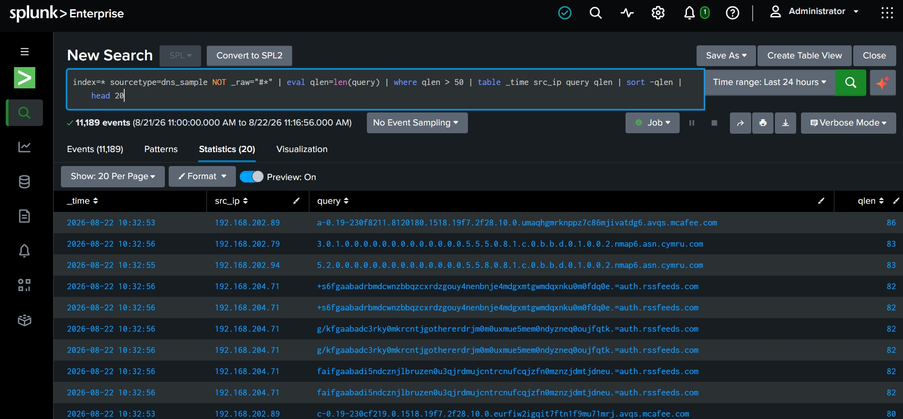
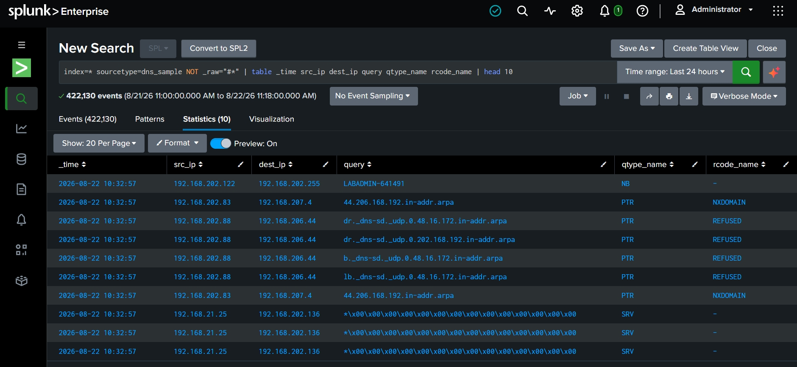

# Project 1: DNS Log Analysis

## Objective

Ingest a real captured DNS log into Splunk and hunt for signs of malicious activity — DGA-style NXDOMAIN patterns, DNS tunneling indicators (long/high-entropy queries, unusual query types), and general traffic baselining (top domains, top clients).

## Data source

[dns.log.gz](https://www.secrepo.com/maccdc2012/dns.log.gz) — a Zeek/Bro DNS log from the MACCDC 2012 network capture.

## Environment

Splunk Enterprise (Docker), sourcetype `dns_sample`.

## Ingestion

1. Extracted `dns.log.gz` and uploaded the raw `dns.log` via **Settings → Add Data → Upload**.
2. Set a custom source type: `dns_sample`.
3. Verified events landed with `index=main sourcetype=dns_sample earliest=0 latest=now`.

## Update (2026-09-18) — re-ingested and re-verified

This project's data was re-ingested from scratch with the deployed [`splunk-app/`](../splunk-app) configuration (real 2012 timestamps via `TIME_PREFIX`/`TIME_FORMAT`, an anchored `LINE_BREAKER`, tab-delimiter field extraction) and every query below was re-run live. What changed and what didn't:

- **Event count:** the original upload indexed 422,130 events from a file with 427,935 lines; the re-ingest indexes all 427,935. The shortfall is consistent with the line-merging behavior documented in Project 6, though the original ingestion's exact cause was never separately diagnosed.
- **`_time` is now the real capture time** (2012-03-16 to 2012-03-17). Because of that, every query now carries `earliest=0 latest=now` — pasted into Splunk's default "Last 24 hours" picker they would otherwise return nothing.
- **Query 6 was broken on current Splunk** (`stats count by count` is rejected: *"output field 'count' cannot have the same name as a group-by field"*); rewritten below with distinct field names.
- **Findings are unchanged.** The one figure that moved is in the screenshot caption below (`qlen > 50`: 11,189 originally, 11,496 on the re-ingested data). The screenshots themselves are as originally captured, before queries were pinned to `index=main`.
- The long-subdomain lead flagged below was later investigated in full — see [`investigation/INVESTIGATION.md`](./investigation/INVESTIGATION.md).

## Field extraction — and a bug I caught

Zeek's `dns.log` is tab-separated. I initially wrote a 24-field extraction regex based on the modern Zeek `dns.log` schema (which includes an `rtt` field). That produced bad output: the `query` field was capturing numeric `qclass` values instead of actual domain names, and searches for long or rarely-seen domains returned zero results — a red flag, since that's statistically unlikely across any real traffic capture.

Checking the file's own `#fields` header line (`Select-String -Path dns.log -Pattern "^#fields"`) confirmed the cause: this capture is from an older Bro version (2012), and its `dns.log` **doesn't include an `rtt` column** — that field was added in later Zeek releases. Every column after `trans_id` was shifted by one position as a result. Fixed the extraction to match the real 23-field schema (as originally written, a regex; since converted to an equivalent tab-`DELIMS` list in [`splunk-app/default/transforms.conf`](../splunk-app/default/transforms.conf), with the 23-field count re-verified against every line of the real file):

```
^(?<ts>[^\t]+)\t(?<uid>[^\t]+)\t(?<src_ip>[^\t]+)\t(?<src_port>[^\t]+)\t(?<dest_ip>[^\t]+)\t(?<dest_port>[^\t]+)\t(?<proto>[^\t]+)\t(?<trans_id>[^\t]+)\t(?<query>[^\t]+)\t(?<qclass>[^\t]+)\t(?<qclass_name>[^\t]+)\t(?<qtype>[^\t]+)\t(?<qtype_name>[^\t]+)\t(?<rcode>[^\t]+)\t(?<rcode_name>[^\t]+)\t(?<AA>[^\t]+)\t(?<TC>[^\t]+)\t(?<RD>[^\t]+)\t(?<RA>[^\t]+)\t(?<Z>[^\t]+)\t(?<answers>[^\t]+)\t(?<TTLs>[^\t]+)\t(?<rejected>.+)$
```

**Takeaway:** never assume a log's field schema from generic documentation or an older extraction template — confirm it against the source file's own header before building a parser. A wrong field mapping doesn't error out loudly; it silently produces empty or misleading results, which is a worse failure mode in real detection engineering work than an outright crash.

## Queries used

Modernized for the detection-as-code pass (Project 7): `index=*` is now pinned to `index=main`, and the `NOT _raw="#*"` filter that used to strip Zeek's `#`-prefixed header/comment lines client-side at search time is gone — that filtering now happens at index time instead, via `props.conf`'s `TRANSFORMS-nullqueue` routing those lines to `nullQueue` before they're ever indexed (see [`splunk-app/default/props.conf`](../splunk-app/default/props.conf)). Same effect, but the exclusion no longer has to be repeated in every single query by hand.

### Baseline queries

**1. Top queried domains** (baseline)
```
index=main sourcetype=dns_sample earliest=0 latest=now | stats count by query | sort -count | head 20
```

**2. Top clients by query volume**
```
index=main sourcetype=dns_sample earliest=0 latest=now | stats count by src_ip | sort -count | head 20
```

**3. NXDOMAIN lookups** (possible DGA / malware beaconing — repeated failed resolutions to algorithmically-generated domain names)
```
index=main sourcetype=dns_sample earliest=0 latest=now rcode_name="NXDOMAIN" | stats count by src_ip, query | sort -count | head 20
```

**4. Query type distribution** (an unusual volume of TXT/NULL records can indicate DNS tunneling)
```
index=main sourcetype=dns_sample earliest=0 latest=now | stats count by qtype_name | sort -count
```

**5. Long domain names** (tunneling / data exfiltration indicator — legitimate domains are rarely 50+ characters)
```
index=main sourcetype=dns_sample earliest=0 latest=now | dedup query | eval qlen=len(query) | table query qlen | sort -qlen | head 15
```

**6. Domain rarity distribution** (how many domains were seen exactly N times — a cleaner check than hard-filtering to `count=1`)
```
index=main sourcetype=dns_sample earliest=0 latest=now | stats count as times_seen by query | stats count as domains by times_seen | sort times_seen
```

### Extended queries (added in the detection-as-code pass)

**7. First-seen domain detection** — ranks domains by how late in the capture window they first appear, as a proxy for "newly observed" in the absence of a longer rolling historical baseline (a caveat worth stating plainly: this is a one-time static capture, not a live production feed with weeks of prior history to diff against — a real deployment would compare against a rolling lookback, not just rank within one capture's own timespan):
```
index=main sourcetype=dns_sample earliest=0 latest=now | stats earliest(_time) as first_seen, latest(_time) as last_seen, count as total_count by query | eval first_seen=strftime(first_seen, "%Y-%m-%d %H:%M:%S"), last_seen=strftime(last_seen, "%Y-%m-%d %H:%M:%S") | sort -first_seen | head 20
```

**8. Domain rarity scoring** — extends Query 6 from a raw frequency histogram into a per-domain inverse-frequency score, so individual rare domains can be sorted and triaged directly instead of only seeing the shape of the distribution:
```
index=main sourcetype=dns_sample earliest=0 latest=now | stats count as domain_count by query | eventstats sum(domain_count) as total_queries | eval domain_freq=domain_count/total_queries | eval rarity_score=round(-1*log(domain_freq, 10), 3) | sort -rarity_score | head 20
```

## Findings

- **NXDOMAIN / REFUSED traffic**: the general event sample shows scattered `NXDOMAIN` responses (e.g. reverse-DNS lookups like `44.206.168.192.in-addr.arpa`) and `REFUSED` responses to internal `_dns-sd._udp` service-discovery PTR queries. This lines up with normal internal network chatter — mDNS/Bonjour-style service discovery and reverse lookups for private ranges — rather than DGA-style beaconing.
- **Domain rarity (`count=1` hard filter)**: mostly automated IP-reputation/blocklist lookups (`*.spamrats.com`, `*.spamcop.net`, `*.dnsbl.tornevall.org`, `*.sorbs.net`) plus one long IPv6 reverse-DNS query. This is typical background noise from mail/security tooling checking sender reputation, not attacker-controlled infrastructure.
- **Long domain names (tunneling indicator) — most notable result**: several queries over 80 characters were observed. One pattern stands out: repeated long, base32/base64-looking subdomains (e.g. `+s6fgaabadrbmdcwnzbbqzcxrdzgouy4nenbnje4mdgxmtgwmdqxnku0m0fdq0e.=auth.rssfeeds.com`) all from a single host, `192.168.204.71`, to `auth.rssfeeds.com`. Repeated high-entropy-looking subdomains from one source to one domain is a classic DNS-tunneling / C2-beaconing shape. It's worth a follow-up pivot on `src_ip=192.168.204.71` before drawing a firm conclusion — this single query flags it as a lead, not a confirmed verdict.
- **Top domains / clients and query-type distribution** (Queries 1, 2, 4): reproduce with the SPL above — not captured in a saved screenshot for this run.

## Screenshots

*Note (2026-09-20): these three were captured during the original run, before the timestamp and retention fixes described under Update/Correction above, so they show `_time` as the 2026-08-22 ingestion time (not the 2012 capture time) and a pre-pinning `index=*` search bar. The result sets they show are unaffected by that; the current queries above use `index=main` and `earliest=0 latest=now`. Their links were also repointed on this date: the README had referenced descriptive filenames that were never committed, so the images rendered as broken on GitHub. The original files were not renamed.*

**1. Domain rarity — `count=1` hard filter** (variant of Query 6)

Every domain that appears exactly once in the capture window. Dominated by reverse-DNS (`*.ip6.arpa`) and DNSBL/reputation-checking lookups — routine, not attacker traffic.

**2. Long domain names — tunneling indicator** (Query 5, extended with `_time`/`src_ip` and an 80-char threshold)

11,189 events matched `qlen > 50` in the original run (11,496 when re-run on 2026-09-18 against the re-ingested data). The repeated encoded-looking subdomains from `192.168.204.71` to `auth.rssfeeds.com` are the standout — see Findings above.

**3. Sample raw events — field-extraction check**

`_time`, `src_ip`, `dest_ip`, `query`, `qtype_name`, and `rcode_name` all populate correctly after the schema fix above — confirms the 23-field regex is extracting cleanly, including `NXDOMAIN`/`REFUSED` rcodes and NetBIOS/mDNS-style broadcast queries (`NB`, `SRV` with null-byte-padded names).
