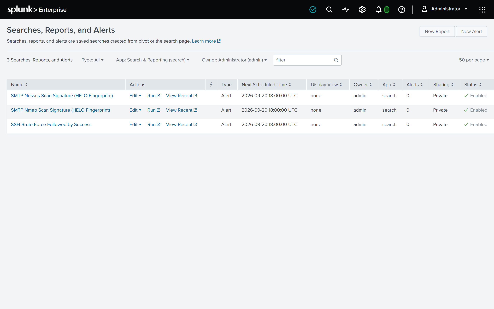

# Project 7: Detection-as-Code

## Objective

Formalize the strongest findings from Projects 1-6 into standing detections, instead of one-off hunting queries: Sigma rules mapped to MITRE ATT&CK techniques, hand-translated into Splunk SPL, and wired up as real Splunk alerts where the data supports it.

## Approach

Each detection is expressed as one or more Sigma YAML files in this folder, translated into SPL, and (where applicable) saved as a scheduled Splunk alert. A note on scope: Sigma's correlation-rule feature (used below for the SSH detection) is a newer part of the spec, and `sigma-cli`'s automatic translation support for it is still uneven - so correlation rules here are documented as the conceptual detection, while the actual Splunk alert runs the hand-written SPL directly. Same principle as this whole series: real limitations get written down, not hidden. That includes the six detections below (4-9) that don't have a Splunk alert behind them - they're documented as findings-turned-Sigma-rules, not overstated as "live" when they aren't.

## Environment

Same Splunk Enterprise (Docker) instance and ingested data as Projects 1-6 and 8. License check before building any alert: Settings -> Licensing showed an active Enterprise Trial (expires 2026-10-21), confirming alerting was available - Splunk Free does not support scheduled alerts.

## Detections

| # | Title | Source finding | ATT&CK | Files | Splunk alert |
|---|---|---|---|---|---|
| 1 | SSH Brute Force Followed by Success | Project 3, Query 3 | T1110, T1078 | `ssh-failed-login.yml`, `ssh-failed-login-threshold.yml`, `ssh-successful-login.yml`, `ssh-bruteforce-then-success.yml` | Scheduled, hourly, trigger: results > 0 |
| 2 | SMTP Nmap Scan Signature (HELO Fingerprint) | Project 5, Query 5 | T1595, T1046 | `nmap-scan-signature.yml` | Scheduled, hourly, trigger: results > 0 |
| 3 | SMTP Nessus Scan Signature (HELO Fingerprint) | Project 5, Query 5 | T1595 | `nessus-scan-signature.yml` | Scheduled, hourly, trigger: results > 0 |
| 4 | SMTP Command-Injection Probe in Envelope Fields | Project 5, Query 4 | T1190 | `smtp-injection-probe.yml` | Not configured - documented finding only (see below) |
| 5 | DHCP Lease Pool Dominated by a Single Host | Project 6, Known limitations | - (deliberately untagged, see below) | `dhcp-lease-event.yml`, `dhcp-lease-anomaly.yml` | Not configured - informational only (see below) |
| 6 | DNS Tunneling via High-Cardinality Subdomains | Project 1, Findings | T1071.004, T1048.003 | `dns-query-event.yml`, `dns-tunneling-high-cardinality.yml` | Not configured - pending investigation results (see below) |
| 7 | Web Vulnerability Scanner or Directory Brute-Forcer User-Agent | Project 8, Queries 3 & 5 | T1595.002 | `http-scanner-user-agent.yml` | Not configured - documented finding only (see below) |
| 8 | Zeek HTTP SQL Injection Signature Tag | Project 8, Query 1 | T1190 | `http-sqli-signature-tag.yml` | Not configured - documented finding only (see below) |
| 9 | VMware ESX SDK Directory Traversal Probe | Project 8, Query 2 | T1190 | `http-vmware-sdk-path-traversal.yml` | Not configured - documented finding only (see below) |

The three live alerts (detections 1-3), enabled and scheduled hourly on the local instance (Settings -> Searches, Reports, and Alerts, captured 2026-09-20). All three return 0 rows in their real hourly windows because the capture is 2012 data; the detection logic is validated by running the same SPL over the full capture (see each detection's "Verified against" note).



### 1. SSH Brute Force Followed by Success

**Why this one:** Project 3's headline finding was two hosts breached by the same source after about a dozen failed logins each - a textbook "the attacker got in" signature, and the clearest case in the whole portfolio for turning a hunt into a standing detection.

**Sigma modeling:** expressed as four files rather than one, because the underlying pattern is a correlation across two conditions (a failure-count threshold, then a success), not a single-event match:
- `ssh-failed-login.yml` - the broad base event (any single failed login); not meaningful on its own, exists only as the thing the threshold rule below correlates.
- `ssh-failed-login-threshold.yml` - a Sigma `event_count` correlation over the base rule above, firing when one source/destination pair exceeds 5 failed logins within an hour. (Originally written as a single-rule `condition: selection | count() by src_ip, dest_ip > 5` - that pipe-aggregation syntax is deprecated and pySigma rejects it outright, confirmed directly via `sigma check`; splitting into a base rule plus an `event_count` correlation is the corrected, native-Sigma equivalent.)
- `ssh-successful-login.yml` - flags any successful login (broad by design; only meaningful combined with the rule above).
- `ssh-bruteforce-then-success.yml` - the correlation rule, `type: temporal_ordered`, requiring the failure-threshold correlation to fire before the success rule for the same `src_ip`/`dest_ip` pair within a 1-hour window. Verified directly that `sigma convert` cannot translate this one (`Correlation type 'temporal_ordered' is not supported by backend`) - a real, current pysigma-backend-splunk limitation, not a hypothetical one; see the CI workflow's own comment on this step.

**SPL (what actually runs as the Splunk alert):**
```
index=main sourcetype="ssh_sample" earliest=-1h latest=now | sort 0 _time | streamstats count(eval(status="failure")) as fails_before by src_ip, dest_ip | where status="success" AND fails_before > 5 | stats max(fails_before) as failures_before_success, count as successes_after_failures, min(_time) as first_success by src_ip, dest_ip | eval first_success=strftime(first_success,"%Y-%m-%d %H:%M:%S") | sort - failures_before_success
```

**Ordering (changed 2026-09-18):** the original SPL counted failures and successes per pair *independently* (`stats count(eval(...))`), which cannot tell whether a success came before or after the failures — so it did not actually implement the `temporal_ordered` correlation this section describes, and matched 18 pairs. This version uses `streamstats` over time-sorted events to count only the failures that occurred *before* each success, and matches **11** pairs over the full capture.

**Search window:** `earliest=-1h latest=now`, matching the correlation rule's declared `timespan: 1h` and the alert's hourly schedule. This was previously `earliest=0`, which rescans the entire index on every run - against a static one-time capture that means re-matching the same already-alerted brute-force pairs every single hour, forever. The window has to equal the correlation timespan, or the SPL alert and the Sigma rule it claims to implement silently drift apart.

**Splunk alert:** `SSH Brute Force Followed by Success` - Scheduled, runs hourly (matching the correlation rule's `timespan: 1h`), trigger condition `Number of Results > 0`, action: add to Triggered Alerts (no email action configured - this lab instance has no outbound mail server set up, a deliberate scope decision rather than an oversight).

**False positives (documented per Sigma's `falsepositives` field):** a legitimate user mistyping their password several times before succeeding; automated retry logic in a monitoring or config-management tool that eventually authenticates successfully.

**Verified against:** Project 3's finding - `192.168.204.45 -> 192.168.28.203` (95 failures and 1 success in total) and `192.168.204.45 -> 192.168.21.253` (57 failures and 1 success). The ordered SPL returns both pairs, each with **12 failures before the success** (2012-03-16 14:50:12 and 15:02:13); the remaining failures (83 and 45) came *after* it. (Project 3's original wording said "95 failures, then 1 success" — see its Correction note.)

**Validation on the static capture (2026-09-18):** run with `earliest=0 latest=now` over the full capture, the SPL above returns 11 pairs, including both headline pairs; in its real `-1h` window it returns **0 rows**, because this capture is 2012 data. Nothing here can make the *scheduled* alert fire — what is validated is the detection logic, not the schedule. A live feed (or the [`detection-lab/`](../detection-lab) replay pipeline) is what would exercise it.

### 2. SMTP Nmap Scan Signature (HELO Fingerprint)

**Why this one:** Project 5's Query 5 turned up two distinct scanner fingerprints hiding in the `helo` field instead of a real mail-client hostname. This one is Nmap's SMTP script announcing itself via `nmap.scanme.org` - a broad, network-wide sweep pattern rather than a targeted probe, and cheap to detect reliably since the fingerprint string never varies.

**Sigma modeling:** a single-event match - `helo|contains: 'nmap'` - deliberately not scoped to any one source, since the pattern's signature is *breadth* (many sources, one hit each) rather than repetition from one host.

**SPL (what actually runs as the Splunk alert):**
```
index=main sourcetype="smtp_sample" earliest=-1h latest=now helo="*nmap*"
```

**Search window:** `earliest=-1h latest=now`, matching the alert's hourly schedule. This was previously `earliest=0`, which rescans the entire index on every run - against a static capture that means re-alerting on the same hosts every hour, forever, instead of firing once per genuinely new event in the window.

**Splunk alert:** `SMTP Nmap Scan Signature (HELO Fingerprint)` - Scheduled, hourly (no correlation window to match, so hourly is just a reasonable default cadence), trigger condition `Number of Results > 0`, action: add to Triggered Alerts only, permissions private.

**False positives (documented per Sigma's `falsepositives` field):** an authorized internal vulnerability-scanning or network-inventory process using Nmap's SMTP script as part of routine scanning.

**Verified against:** Project 5's finding, corrected on 2026-09-18 against the raw `smtp.log` and a live re-run - the fingerprint appears in **30 events from seven source hosts** (28 distinct source/destination pairs, almost every pair touched once), consistent with a broad sweep rather than a targeted mail client. The largest sweeper is `192.168.204.45` (11 mail servers) - the same host that got into two SSH targets in detection 1. (The original write-up listed only three sources.) Run with `earliest=0 latest=now` the SPL above matches those 30 events; in its real hourly window it returns 0 rows, because the capture is 2012 data.

### 3. SMTP Nessus Scan Signature (HELO Fingerprint)

**Why this one:** The second scanner fingerprint from the same Query 5 - Nessus's vulnerability-scanner HELO strings (`mail.nessus.org` or bare `nessus`). Split into its own rule rather than folded into the Nmap one because the two tools produce visibly different traffic patterns worth tracking separately: this one is a concentrated, repeat-hit pattern from essentially one source rather than a one-shot sweep.

**Sigma modeling:** single-event match - `helo|contains: 'nessus'`.

**SPL (what actually runs as the Splunk alert):**
```
index=main sourcetype="smtp_sample" earliest=-1h latest=now helo="*nessus*"
```

**Search window:** `earliest=-1h latest=now`, matching the alert's hourly schedule, for the same reason as the Nmap detection above - a hardcoded `earliest=0` on an hourly schedule re-fires on the same historical hits indefinitely rather than only alerting on genuinely new activity.

**Splunk alert:** `SMTP Nessus Scan Signature (HELO Fingerprint)` - Scheduled, hourly, same reasoning as the Nmap alert, trigger condition `Number of Results > 0`, action: add to Triggered Alerts only, permissions private.

**False positives (documented per Sigma's `falsepositives` field):** an authorized internal vulnerability-management scan (e.g. a scheduled Nessus/Tenable scan against the mail server) using its default HELO string.

**Verified against:** Project 5's finding, corrected on 2026-09-18 against the raw `smtp.log` and a live re-run - **21 events from two sources**: `192.168.202.110` (19 events across 9 hosts, several hit repeatedly) and `192.168.202.138` (2 events, 1 host). `.110` is also responsible for 10 of the 11 command-injection probes below, which is what elevates this from routine noise to worth a standing alert. (The original write-up named only `.110`.) Run with `earliest=0 latest=now` the SPL above matches those 21 events; in its real hourly window it returns 0 rows (2012 data).

### 4. SMTP Command-Injection Probe in Envelope Fields

**Why this one:** Project 5's Query 4 found the sharpest finding in the whole SMTP hunt - shell metacharacters planted in the `RCPT TO` / `MAIL FROM` envelope fields, a classic blind command-injection probe. It's documented here as a Sigma rule and SPL translation, but deliberately **not yet wired up as a live Splunk alert** - it's included as a finding worth standing detection, not overstated as one already running.

**Sigma modeling:** two selections combined with `1 of selection_*`, since the injection attempt can show up in either envelope field independently: `rcptto` checked for pipe, semicolon, or embedded quote; `mailfrom` checked for pipe or semicolon.

**SPL (translation, not yet scheduled):**
```
index=main sourcetype="smtp_sample" earliest=0 latest=now (rcptto="*|*" OR rcptto="*;*" OR rcptto="*\"*" OR mailfrom="*|*" OR mailfrom="*;*")
```

**Search window:** `earliest=0 latest=now` is kept here deliberately, unlike the three scheduled alerts above. There is no live schedule for this query to match a window against - see "Why no alert yet" below - so a relative window would just mean the query silently returns nothing, which is worse than an honest full-range search over a static capture. If this is ever wired up as a real scheduled alert, the window has to be set then, matching whatever cadence is chosen at that point.

**Why no alert yet:** the underlying finding was a fixed, already-occurred set of 11 events in a static capture, not an ongoing feed - there's nothing left in this lab dataset for a schedule to catch going forward. The rule is written and ready; standing it up as a real alert is the natural next step if this were pointed at live mail traffic instead of a one-time capture.

**False positives (documented per Sigma's `falsepositives` field):** a legitimate email address or display name that happens to contain a semicolon or quote character (rare, but technically valid in some address formats).

**Verified against:** Project 5's original finding - 11 events with `rcptto` set to `root+:"|sleep 5 #"` and `mailfrom` spoofed as `<root@[source-ip]>`; **8 of 11** destinations returned `250 Ok`, accepting the malformed address without rejecting it (2 returned `451`, 1 returned `501`) - corrected on 2026-09-18 from an earlier "7 of 11" against the raw `smtp.log`; 10 of the 11 probes came from `192.168.202.110`, 1 from `192.168.202.138`.

### 5. DHCP Lease Pool Dominated by a Single Host

**Why this one, and why it's different from the rest:** every other detection in this folder maps to a MITRE ATT&CK technique - this one deliberately doesn't. Project 6's headline finding (a single MAC address responsible for roughly half of all DHCP traffic in the capture) is the signature of a boot-looping or misconfigured device, not a mapped adversary technique. Forcing an ATT&CK tag onto an operational anomaly would misrepresent what this actually detects, so the Sigma rule is tagged `level: informational` with no `tags:` field at all.

**Sigma modeling:** expressed as two files, a broad base rule (`dhcp-lease-event.yml`, any event with a `mac` field) plus a Sigma `event_count` correlation (`dhcp-lease-anomaly.yml`) counting by `mac` over a 24-hour window, threshold `> 100` (recalibrated 2026-09-18 from `> 20` - see the threshold note below). Originally written as a single-rule `condition: selection | count() by mac > 20` - that pipe-aggregation syntax is deprecated and pySigma rejects it outright, confirmed directly via `sigma check`; the base-rule-plus-correlation split is the corrected, native-Sigma equivalent, same pattern used for the SSH threshold rule above.

**SPL (translation, not yet scheduled):**
```
index=main sourcetype="dhcp_sample" earliest=0 latest=now | stats count by mac | where count > 100
```

**Search window:** `earliest=0 latest=now` is kept here for the same reason as the command-injection detection above - this one is explicitly informational and unscheduled (see the threshold note below), so there is no schedule cadence for a relative window to match. Forcing one on would just make the query permanently return nothing rather than reflect an honest full-capture view.

**Threshold note - recalibrated 2026-09-18, and how it got here:** Project 6 documented a severe Splunk line-breaking bug that undercounted DHCP events - the true top host issued 744 of 1,502 real records, but Splunk's own indexed view only ever showed 41. This rule's original threshold (`> 20`) was calibrated against that undercounted view, and the rule's own text said a real deployment should fix ingestion and then re-check it. With the fix in place, the re-check on the true counts: `> 20` flags **9 of 87 MACs** (744, 94, 79, 51, 42, 39, 35, 26, 25 records) - too loose for a rule about *one host dominating the pool* - while `> 50` flags 4 and `> 100` flags **exactly one**, the 744-record host (49.5% of all records; the next-highest is 94, 6.3%). The threshold is now `> 100`. It stays informational and unscheduled: like detections 4 and 6-9, it describes a fixed set of events in a static capture, not a feed.

**False positives (documented per Sigma's `falsepositives` field):** a DHCP relay or gateway device that legitimately renews leases on behalf of many downstream clients; a single busy access point or NAT device generating high normal lease-renewal volume.

**Verified against:** Project 6's raw-file cross-check - MAC `00:26:9e:83:a2:30` (assigned `192.168.202.76`) issued 744 of 1,502 real DHCP records (49.5% of all traffic), invisible in Splunk's own `stats count by mac` output because the line-breaking bug folded nearly all of its requests into a handful of merged events.

**Line-breaking fix verified live (2026-09-18):** `splunk-app/`'s `[dhcp_sample]` `LINE_BREAKER` fix was deployed to a real local Splunk instance and `dhcp.log` re-ingested fresh. Re-running the verification query above against the live index: `total_records=1502`, `unique_macs=87`, `unique_ips=99`, top MAC `00:26:9e:83:a2:30` at **744** — an exact match with the raw-file ground truth. The undercount that made the original threshold unreliable is now fixed at the source, and the threshold was recalibrated on the true counts (see the threshold note above). Full detail in `RUNBOOK.md`, items 14-17.

### 6. DNS Tunneling via High-Cardinality Subdomains

**Why this one, and why it's different from the rest:** every other detection in this folder was confirmed and promoted the same day it was found. This one is different on purpose - Project 1's original hunt flagged repeated long, base32/base64-looking subdomains from a single host (`192.168.204.71`) to a single domain (`auth.rssfeeds.com`) as a DNS-tunneling *lead*, explicitly not a confirmed finding, and left it there rather than overstating it. Projects 3, 5, and 6 each turned their headline finding straight into a detection; Project 1's never did, until now. The full pivot - six specific techniques, each with a query and a `RESULTS: <pending>` placeholder - lives in [`01-dns-log-analysis/investigation/INVESTIGATION.md`](../01-dns-log-analysis/investigation/INVESTIGATION.md), since a proper writeup didn't fit in a table row.

**Sigma modeling:** expressed as two files, a broad base rule (`dns-query-event.yml`, any DNS A-record query) plus a Sigma `value_count` correlation (`dns-tunneling-high-cardinality.yml`) counting distinct `query` values per `src_ip` within a 1-hour window, threshold `>= 15`. Grouping further by parent domain, and the accompanying mean-subdomain-length check, aren't expressible as native Sigma fields (`parent_domain` only exists after an SPL `rex` extraction, not on the raw event), so both stay applied at the SPL-translation layer only - same "documented as the conceptual detection, hand-translated to SPL" pattern already used for the SSH correlation rule above. (An earlier version of this rule used a single-rule pipe-aggregation condition instead of a proper correlation; that syntax is deprecated and pySigma rejects it outright, confirmed directly via `sigma check` - the base-rule-plus-correlation split above is the corrected form.)

**SPL (translation, not yet scheduled - and not yet validated against real query results):**
```
index=main sourcetype="dns_sample" earliest=0 latest=now | rex field=query "(?<subdomain>^[^.]+)\.(?<parent_domain>.+)$" | eval subdomain_length=len(subdomain) | stats dc(query) as unique_subdomains, avg(subdomain_length) as mean_subdomain_length, count as total_queries by src_ip, parent_domain | where unique_subdomains > 15 AND mean_subdomain_length > 35
```

**Search window:** `earliest=0 latest=now` is kept here deliberately, same reasoning as detections 4 and 5 above - there is no live schedule yet for this query to match a window against, and the actual threshold values (`15`, `35`) are placeholders pending the investigation's real results, not calibrated figures yet. Forcing a relative window on an unvalidated, unscheduled query would just add a second layer of guesswork on top of the first.

**Why no alert yet:** unlike detections 4 and 5, which are finished findings simply not wired to a live schedule, this one is genuinely incomplete - the thresholds above haven't been checked against actual query output yet. [`RUNBOOK.md`](../RUNBOOK.md) lists the six queries that need to be run first; this detection moves from "pending investigation results" to either a real scheduled alert or a documented ruled-out finding once they are.

**False positives (documented per Sigma's `falsepositives` field):** reputation/AV lookup services generating high subdomain churn against one parent domain (e.g. McAfee GTI, Sophos XL, Spamhaus, SORBS); per-object CDN hostnames, where each cached asset or edge node gets its own long, varied subdomain under one parent domain; a legitimate dynamic-DNS or IoT device-provisioning service issuing unique per-device subdomains under one parent domain.

**Verified against:** Evidence #1-5 in `INVESTIGATION.md` have now been run for real against a live Splunk instance (2026-09-18) — see `RUNBOOK.md` items 6-13. Results lean *against* a sustained tunneling read: a 118.7-second burst of 12 events (not sustained), #24-of-617 network-wide by subdomain ratio, and entropy below even the "normal English" reference anchor. This row stays **"Not configured - pending investigation results"** rather than moving to live or ruled-out — the evidence doesn't support promoting the placeholder thresholds (`15`, `35`) above to a real scheduled alert, but Evidence #6 (`conn.log` correlation) is still genuinely unresolved, so "ruled out" would overstate it. Full verdict in `INVESTIGATION.md`'s Summary.

### 7. Web Vulnerability Scanner or Directory Brute-Forcer User-Agent

**Why this one:** Project 8's dominant signal - well over half of the whole HTTP log is scanner traffic that announces itself in the `User-Agent` header. Same idea as the SMTP HELO fingerprints in detections 2 and 3, applied to the web layer: cheap to detect, and a stable string per tool.

**Sigma modeling:** a single-event match - `user_agent|contains` any of `DirBuster`, `Nikto`, `Nmap Scripting Engine`, `Nessus`. `sigma convert` emits this as `user_agent IN ("*DirBuster*", "*Nikto*", "*Nmap Scripting Engine*", "*Nessus*")`.

**SPL (translation, not yet scheduled):**
```
index=main sourcetype="http_sample" earliest=0 latest=now user_agent IN ("*DirBuster*", "*Nikto*", "*Nmap Scripting Engine*", "*Nessus*") | stats count as requests, dc(dest_ip) as targets by src_ip | sort - requests
```

**Search window / why no alert yet:** same reasoning as detection 4 - the underlying finding is a fixed set of events in a static 2012 capture, so there is nothing for a schedule to catch, and a relative window would just return nothing. `earliest=0 latest=now` is kept deliberately.

**False positives (documented per Sigma's `falsepositives` field):** an authorized vulnerability-management scan or penetration test using these tools' default User-Agent strings; and a User-Agent is trivially easy to spoof, so *no match* does not mean *no scanning*.

**Verified against (live, 2026-09-18):** **1,315,522 requests from 16 source hosts.** DirBuster: 1,289,185 requests from one source (`192.168.203.63`) against one target (`192.168.229.101`); Nikto: 14,945 requests from one source against 2 targets; the Nmap Scripting Engine: 10,629 requests from 13 sources against 75 targets; Nessus: 763 requests from 3 sources against 47 targets.

### 8. Zeek HTTP SQL Injection Signature Tag

**Why this one:** Zeek's HTTP analyzer already tags requests carrying SQL-injection patterns in the URI (`HTTP::URI_SQLI` in the `tags` field), so this detection reuses a signature engine rather than re-implementing one in SPL - and it links two projects: the source responsible for most of the hits is the same host Project 5 fingerprinted as the Nessus scanner.

**Sigma modeling:** a single-event match - `tags|contains: 'HTTP::URI_SQLI'`.

**SPL (translation, not yet scheduled):**
```
index=main sourcetype="http_sample" earliest=0 latest=now tags="*HTTP::URI_SQLI*" | stats count as requests, count(eval(status_code=200)) as ok_200, dc(dest_ip) as targets by src_ip | sort - requests
```

**Search window / why no alert yet:** as for detection 7 - a fixed set of events in a static capture; `earliest=0 latest=now` kept deliberately.

**False positives (documented per Sigma's `falsepositives` field):** an authorized web-application scan or penetration test; a legitimate URI that happens to contain SQL keywords (rare, but the signature is pattern-based). Coverage is also limited to what Zeek's own signature recognizes - it is blind to injection styles it doesn't know.

**Verified against (live, 2026-09-18):** **2,731 tagged requests from 9 source hosts against 32 targets**, 221 of which received `200 OK` (not proof of a successful injection - the shortlist to look at first). `192.168.202.110` accounts for 2,140 of them.

### 9. VMware ESX SDK Directory Traversal Probe

**Why this one:** a specific, named pattern rather than a generic one - requests to VMware's `/sdk/` endpoint with `../` sequences that reach `/etc/vmware/hostd/vmInventory.xml`, the publicly documented directory-traversal flaw in VMware ESX/ESXi/Server (CVE-2009-3733). Worth a standing rule because a hit on an exposed hypervisor management endpoint is high-value even when it is only a scanner's check.

**Sigma modeling:** a single-event match with all three conditions required - `uri|contains|all: ['/sdk/', '/../', 'vmware']`.

**SPL (translation, not yet scheduled):**
```
index=main sourcetype="http_sample" earliest=0 latest=now uri="*/sdk/*" uri="*/../*" uri="*vmware*" | stats count as requests, dc(dest_ip) as targets, count(eval(status_code=200)) as ok_200 by src_ip, user_agent | sort - requests
```

**Search window / why no alert yet:** as for detection 7 - a fixed set of events in a static capture; `earliest=0 latest=now` kept deliberately.

**False positives (documented per Sigma's `falsepositives` field):** an authorized vulnerability scan checking for this specific flaw - which, in this dataset, is what almost all of it is.

**Verified against (live, 2026-09-18):** **97 requests from 7 source hosts against 31 targets**, between 2012-03-16 12:30 and 2012-03-17 15:37 UTC - **95 sent by the Nmap Scripting Engine and 2 by Nikto**, so these are scanner checks for a known flaw, not a bespoke exploit. Responses were overwhelmingly `400`/`403`/`404`/`500`; two returned `200 OK` with a 90-byte body, both from `192.168.203.45` to `192.168.21.252` at 2012-03-16 13:12:35 - a `200` with a small body is not proof of a successful file read, but they are the only two worth a manual look.
