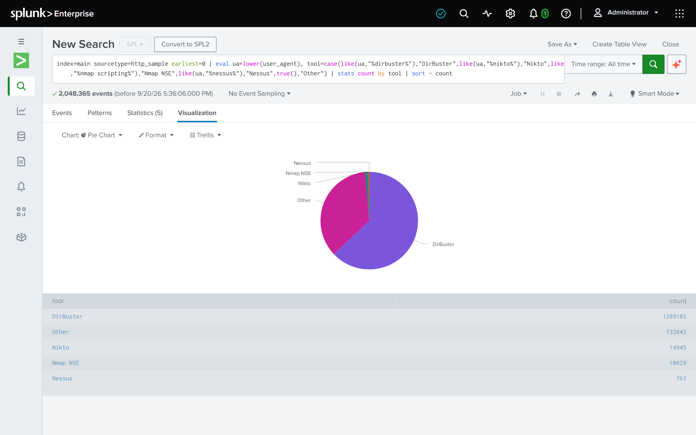

# Project 8: HTTP Log Analysis

## Objective

Hunt for web-layer attack activity in the busiest log type in this capture by a wide margin — reconnaissance/enumeration tooling, injection attempts, and any traffic Zeek's own protocol analyzer flagged as suspicious — and cross-reference against hosts this repo's other projects have already implicated (Project 5's SMTP scanner/injection findings) to see whether the same actors show up here too.

## Data source

[http.log.gz](https://www.secrepo.com/maccdc2012/http.log.gz) — a Zeek/Bro HTTP log from the MACCDC 2012 network capture, using the Bro 2.x 27-field schema (`ts, uid, id.orig_h, id.orig_p, id.resp_h, id.resp_p, trans_depth, method, host, uri, referrer, user_agent, request_body_len, response_body_len, status_code, status_msg, info_code, info_msg, filename, tags, username, password, proxied, orig_fuids, orig_mime_types, resp_fuids, resp_mime_types`).

## Environment

Splunk Enterprise (Docker). Sourcetype `http_sample`.

## Ingestion

This project's history is a little different from Projects 1-6: the raw data was ingested once, early on, and then sat as an undocumented orphan (see "Project history" below) until this pass gave it real field extraction, timing config, and findings.

1. Uploaded `http.log` (1.4GB) as sourcetype `http_sample` — **2,048,365 events** once correctly line-broken (see `splunk-app/default/props.conf`'s `[http_sample]` stanza; an earlier ingestion under this repo's older, un-fixed default line-breaking undercounted this to 2,043,366, the same undercount pattern documented for DHCP in Project 6).
2. `_time` fixed to reflect the real 2012 capture time via `TIME_PREFIX`/`TIME_FORMAT`, same as every other sourcetype in this repo (see `RUNBOOK.md` item 18).

## Project history — why this one looks different from Projects 1-7

This folder used to be `03-http-log-analysis/`, containing three screenshots and a real `http.log` but no README, no field extraction, and no findings — an orphan that also collided with the real `03-ssh-log-analysis/`. Renumbered to `08` and given a real writeup on 2026-09-18, once the raw data's field schema was verified against real sample rows (not assumed — see `splunk-app/default/transforms.conf`'s `[http_sample_fields]` comment for exactly how) rather than guessed at, per the lesson Project 1's own field-extraction bug already taught this repo.

## Field extraction

Delimiter-based (tab), `transforms.conf` stanza `[http_sample_fields]`:

```
DELIMS = "\t"
FIELDS = "ts","uid","src_ip","src_port","dest_ip","dest_port","trans_depth","method","host","uri","referrer","user_agent","request_body_len","response_body_len","status_code","status_msg","info_code","info_msg","filename","tags","username","password","proxied","orig_fuids","orig_mime_types","resp_fuids","resp_mime_types"
```

Field count (27) and order verified against this capture's real data before writing the stanza, not assumed from generic Zeek documentation:
- `tags` (a Bro set-type field) shows the documented `(empty)` convention on ordinary requests, and real signature hits (`HTTP::URI_SQLI`) on attack traffic — confirming it's genuinely populated, not a coincidentally-always-empty column.
- `resp_fuids`/`resp_mime_types` show real Zeek file UIDs paired with real MIME types only on responses that carried a body, `-` otherwise — consistent with their documented purpose.

## Queries used

**1. SQL-injection signature hits, by source**
```
index=main sourcetype=http_sample earliest=0 latest=now tags="HTTP::URI_SQLI" | stats count as hits, dc(dest_ip) as targets by src_ip | sort -hits
```

**2. Path-traversal probes**
```
index=main sourcetype=http_sample earliest=0 latest=now uri="*../*" | stats count as hits, dc(uri) as distinct_paths by src_ip, dest_ip | sort -hits
```

**3. Known scanner/fuzzer user-agent strings**
```
index=main sourcetype=http_sample earliest=0 latest=now (user_agent="*Nmap*" OR user_agent="*Nessus*" OR user_agent="*DirBuster*" OR user_agent="*nikto*" OR user_agent="*sqlmap*") | stats count by src_ip, user_agent | sort -count
```

**4. Non-standard/enumerated HTTP methods**
```
index=main sourcetype=http_sample earliest=0 latest=now NOT (method=GET OR method=POST OR method=HEAD OR method=PUT OR method=DELETE OR method=OPTIONS OR method=CONNECT OR method=TRACE OR method=PROPFIND OR method="-") | stats count by method | sort -count
```

**5. DirBuster's actual target scope**
```
index=main sourcetype=http_sample earliest=0 latest=now user_agent="DirBuster*" | stats dc(dest_ip) as targets, count as total_requests, dc(uri) as distinct_paths_tried by src_ip
```

## Findings

- **One host, one target, 63% of this entire dataset.** `192.168.203.63` ran a DirBuster-0.12 directory brute-force against a single server, `192.168.229.101` — **1,289,185 requests**, 1,267,641 of them distinct paths, out of 2,048,365 total events in the whole log. This single scan is why Project 8's raw data dwarfs every other project in this repo by more than 4x — not organic traffic volume.
- **The SMTP scanner from Project 5 shows up here too, and escalates.** `192.168.202.110` — already identified in `05-smtp-log-analysis` as the source of Nessus's SMTP HELO fingerprint and the SMTP command-injection probes — is also the dominant source of both SQL-injection-signature hits (**2,140** `HTTP::URI_SQLI`-tagged requests across 15 distinct targets, classic UNION-based fuzzing: `?op=cats&year=2008&catview=1+UNION+SELECT+1,1331904439`) and path-traversal probing (3,347 `../`-containing requests against one target alone, 1,695 distinct paths tried). This is the same host behaving the same way across two completely different protocols in this capture — a much stronger signal than either finding alone.
- **Across all sources, 2,731 requests carry Zeek's `HTTP::URI_SQLI` signature tag**, and 221 of those got a `200 OK` response (vs. 2,449 `404`s) — not proof of a successful injection, but the shortlist worth a manual look first if this were a real triage, rather than the full 2,731.
- **A specific, named pattern: the VMware ESX SDK directory traversal.** **97 requests from 7 source hosts against 31 targets** (`192.168.202.79`, `192.168.203.45`, `192.168.202.100`, `192.168.203.61`, `192.168.202.4`, and two IPv6 addresses) asked VMware's `/sdk/` endpoint for `/etc/vmware/hostd/vmInventory.xml` through `../` sequences — the publicly documented directory-traversal flaw in VMware ESX/ESXi/Server (CVE-2009-3733). **95 of the 97 were sent by the Nmap Scripting Engine and 2 by Nikto**, so this is scanners *checking* for a known flaw, not a bespoke exploit. Responses were overwhelmingly `400`/`403`/`404`/`500`; two returned `200 OK` with a 90-byte body, both from `192.168.203.45` to `192.168.21.252` at 2012-03-16 13:12:35 — a `200` with a small body is not proof of a successful file read, but they are the only two worth a manual look. *(Correction, 2026-09-18: an earlier draft of this bullet listed the wrong source hosts — it included the DirBuster host — because it was built from a looser query than the rule now defined in [detection 9](../07-detection-as-code/README.md), and said one `200` where there were two.)*
- **A full, named scanner roster, consistent with Project 5's fingerprinting approach.** Beyond DirBuster and the Nessus/Nikto/Nmap NSE signatures already visible in `user_agent`, Nessus's own web-app-testing plugins show up as literal injection payloads *in the User-Agent header itself* — `nessus=<!--#exec cmd="cat /etc/passwd"-->` and `<!--#include file="nessus897043736.html"-->` from `192.168.202.138` — Server-Side Include (SSI) injection tests, a real (if now-dated) vulnerability class Nessus checks for.
- **The non-standard `method` values are mostly real, not garbage** — `SEARCH`, `ACL`, `INDEX`, `TRACK`, `BCOPY`/`BDELETE`/`BMOVE`/`BPROPFIND`/`BASELINE-CONTROL` are legitimate (if obscure) WebDAV/IIS HTTP verbs, consistent with a scanner systematically enumerating which methods a server accepts — itself a recognized recon technique, not parsing noise. `RPC_CONNECT` specifically is associated with probing Exchange/Outlook-Web-Access RPC-over-HTTP endpoints. A smaller handful of values (`Secure`, `some`, `GNUTELLA`, `NESSUS`) are non-HTTP payloads Zeek's protocol detection routed into its HTTP analyzer — flagged as noise, not findings. One of them is worth a single-event lead, though: at 2012-03-16 18:04:00 UTC, `192.168.204.45` sent text to port 8080 on `192.168.203.45` that Zeek parsed as an HTTP request with method `192.168.24.100` and URI `445 user1 aad3b435…:31d6cfe0… smb_hash tru…` — the layout of credential-database output (host, port, user, hash, hash type), carrying the well-known LM/NT hashes of an *empty* password. It is the only such row in the log (`grep -c smb_hash http.log` = 1), so a lead rather than a finding — but it is `192.168.204.45` again.
- **Overall scope:** 2,048,365 requests, 71 unique clients, 88 unique servers.

## Detections built from this project

Three of these findings are now versioned Sigma rules with matching SPL, validated live and by CI — see [`07-detection-as-code`](../07-detection-as-code/README.md): **detection 7** (scanner User-Agents — 1,315,522 requests, 16 sources), **detection 8** (`HTTP::URI_SQLI` tag — 2,731 requests, 9 sources), and **detection 9** (VMware SDK traversal — 97 requests, 7 sources). All three are documented findings, deliberately unscheduled: this is a static 2012 capture, so there is nothing for a schedule to catch.

## ATT&CK mapping

- **T1595.002 — Active Scanning: Vulnerability Scanning.** DirBuster, Nikto, and Nessus activity.
- **T1190 — Exploit Public-Facing Application.** SQL-injection and VMware SDK path-traversal probes.
- **T1083 / T1213 — File and Directory Discovery / Data from Information Repositories.** The DirBuster brute-force scope and the VMware `vmInventory.xml` traversal target.

## Known limitations

- Zeek's `tags` field only flags `HTTP::URI_SQLI` — it doesn't tag path traversal, WebDAV method enumeration, or SSI injection attempts, so those findings above came from direct `uri`/`method`/`user_agent` pattern searches, not a single signature field. A real detection built on this data would need each of these as its own rule (see `07-detection-as-code/` for the pattern this repo uses elsewhere).
- Most of this pass's analysis queries were not screenshotted — every number above was run for real against the live instance and is reproducible from the queries listed. One was captured afterward (2026-09-20): the per-tool user-agent split below.

## Screenshots

**Scanner user-agent share of the whole capture** (captured 2026-09-20 from the live instance, after the search finished over all 2,048,365 events): DirBuster is 1,289,185 requests (62.9%); Nikto 14,945; Nmap Scripting Engine 10,629; Nessus 763; everything else 732,843. DirBuster + Nikto + Nmap + Nessus = 1,315,522, the event count of detection 7.



Three screenshots survive from this project's original, undocumented ingestion pass (before this writeup) — verification-only, not analysis:
- `screenshot-1787496991418.png` — early ingestion check, page 1 of raw `http_sample` events (775,160 of 775,160 matched at that point, mid-ingest)
- `screenshot-1787497065604.png` / `screenshot-1787497610279.png` — same raw-events view after ingestion completed, confirming 2,043,366 events under the old undercounted config (see "Ingestion" above for why that number changed once the line-breaking fix was applied)
