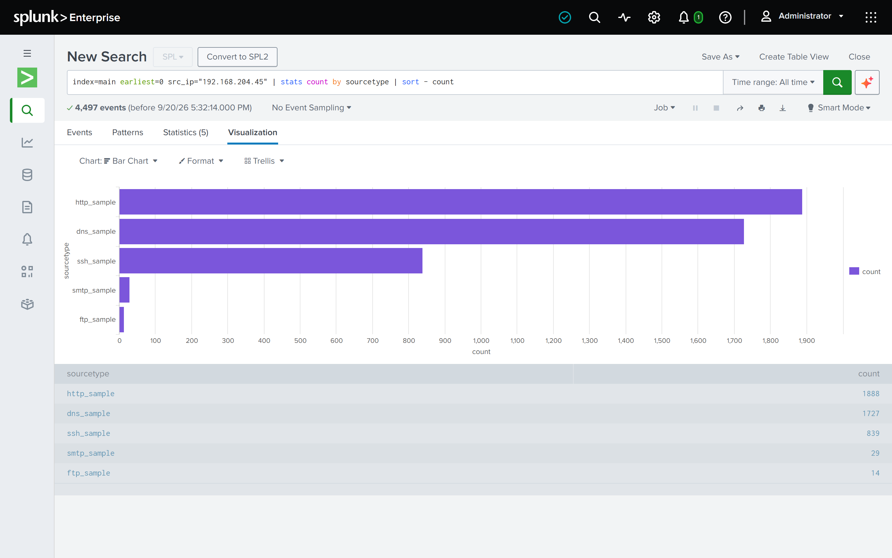

# SOC Splunk Log Analysis Labs

[](https://github.com/sumitjha7727/splunk-log-analysis/actions/workflows/validate.yml)
[](https://github.com/sumitjha7727/splunk-log-analysis/actions/workflows/repo-lint.yml)

Hands-on Splunk SIEM log analysis labs covering seven network log types plus a detection-as-code pass on top of them, run end-to-end against real captured network traffic — ingestion, field extraction, SPL-based threat hunting, and findings write-ups for each log type, then Sigma-modeled standing detections, a deployable Splunk app, and CI validation for the strongest findings among them.

Inspired by [0xrajneesh/Splunk-Projects-For-Beginners](https://github.com/0xrajneesh/Splunk-Projects-For-Beginners) as a starting list of project ideas. Every project here was rebuilt from scratch: original SPL queries, real field-extraction issues worked through (see Project 1 for a schema bug that would've silently broken the analysis), and full findings for each log type — not just a copy of the source guides.

## About

Built by Sumit Kant Jha, SOC Engineer II, as a hands-on exercise in end-to-end SIEM log analysis with Splunk.

## Key findings

- **SSH brute-force to compromise, on two separate hosts** — `192.168.204.45` got into `192.168.28.203` and `192.168.21.253`; in both cases the login succeeded after only **12 failed attempts** (95 and 57 failures in total — the rest came *after* the success, so the run kept going past the point of compromise). The clearest "the attacker got in" signature in the dataset, now a standing, order-aware correlation detection in Project 7.
- **Two vulnerability scanners fingerprinted by their SMTP HELO strings** — Nmap's `nmap.scanme.org` sweep came from **seven** source hosts (30 events across 28 source/destination pairs, almost every pair touched once); the largest sweeper, `192.168.204.45` (11 mail servers), is the same host that got into the two SSH targets above. Nessus's `mail.nessus.org`/`nessus` strings came from two hosts, dominated by `192.168.202.110` (19 events across 9 hosts) — the same host responsible for 10 of the 11 SMTP command-injection probes below.
- **Live command-injection probes against SMTP envelope fields** — shell metacharacters (`|`, `;`, embedded quotes) planted in `RCPT TO`/`MAIL FROM`, with **8 of 11** destination mail servers accepting the malformed address instead of rejecting it outright.
- **A DNS tunneling lead, investigated to an honest conclusion, not just confirmed or dropped** — repeated long subdomains from one host to one domain, first flagged in Project 1 as an unconfirmed pattern. Five of six planned techniques (cache-miss ratio, network-wide subdomain ranking, entropy, beacon timing, payload volume) were run for real against a live Splunk instance; the results lean *against* sustained tunneling (a 118-second burst, not a network-wide outlier, entropy below even the "normal" baseline) — see [`01-dns-log-analysis/investigation/`](./01-dns-log-analysis/investigation) for the full evidence and the one structural anomaly (a literal `=` character baked into the queried domain name) that's still unresolved.
- **A Splunk ingestion bug that erased a network's biggest DHCP anomaly from view** — default line-breaking silently folded 1,502 real DHCP records down to 333 indexed events, hiding the single host responsible for half the network's DHCP traffic until a raw-file cross-check caught it. Fixed at the source in `splunk-app/default/props.conf`, not just noted and left alone.
- **The same scanning host shows up across two unrelated protocols** — `192.168.202.110`, already fingerprinted in Project 5 via its SMTP HELO string and SMTP injection probes, turns out to also be the dominant source of SQL-injection-tagged HTTP requests in Project 8 (2,140 of 2,731) and of `/../` path-traversal requests (10,170 of 15,758) — one host's behavior corroborated independently across completely different log types, not two coincidentally similar findings.
- **63% of the entire HTTP capture is one directory brute-force scan** — a single host ran DirBuster against a single target for 1.29 million of the dataset's 2.05 million requests, alongside scanner checks for the VMware ESX SDK directory-traversal flaw (CVE-2009-3733: 97 requests, 95 from Nmap's scripting engine, two of which returned `200 OK`). Three of Project 8's findings are now versioned Sigma rules (detections 7-9).
- **Malware staging over FTP** — the same `svchost.exe` (6,656 bytes, `application/x-dosexec`) pulled from one FTP server by three different internal hosts with the same `ftp`/`password` login: five transfers across two days, all successful.
- **One host, five log types** — `192.168.204.45` appears as a source in SSH (the two compromises above), SMTP (the largest Nmap sweep), HTTP (939 Nmap Scripting Engine requests, plus the single row of credential-database-style text in the whole HTTP log, sent to port 8080 on `192.168.203.45`), FTP (anonymous logins) and DNS — a profile assembled from independent log types rather than any single one.


*`index=main earliest=0 latest=now src_ip="192.168.204.45" | stats count by sourcetype`, run against the live instance on 2026-09-20.*

Three things this repo is meant to demonstrate, beyond any one finding: that real field-extraction and ingestion bugs get caught and written down rather than quietly worked around off-screen; that a hunt's output should end as a standing, versioned detection instead of a one-off query nobody re-runs; and that "the detection is documented" and "the detection is live" are different claims, kept honestly distinct throughout rather than blurred together.

## Lab environment

- Splunk Enterprise (free trial), run locally via Docker
- Sample data: Zeek/Bro network logs from the [MACCDC 2012](https://www.secrepo.com/maccdc2012/) capture — a public dataset from the Mid-Atlantic Collegiate Cyber Defense Competition, commonly used for SOC/blue-team training. Project 4 is the one exception: it runs three public IPv6-tunneling sample captures through Zeek itself.

To reproduce the Splunk environment:

```bash
docker run -d -p 8000:8000 -p 8088:8088 -p 8089:8089 --name splunk \
  -e SPLUNK_GENERAL_TERMS=--accept-sgt-current-at-splunk-com \
  -e SPLUNK_START_ARGS=--accept-license \
  -e SPLUNK_PASSWORD=<your-password> \
  splunk/splunk:latest
```

Then log in at `http://localhost:8000` with user `admin` and the password you set. Deploy [`splunk-app/`](./splunk-app) **before** ingesting anything: Splunk's default retention silently deletes 2012 data (see its "Known gotchas").

**Running the queries:** the data is from 2012, so every query here states both bounds, `earliest=0 latest=now`. With Splunk Web's default "Last 24 hours" time picker a lone `earliest=0` is ignored and the search silently returns nothing; either keep both bounds or set the picker to All time. Quick check: `index=main earliest=0 latest=now | stats count by sourcetype` should list all seven sourcetypes (2,490,943 events in total). Seven ready-made checks (data, timestamps, fields, alert logic, alert status) with expected results are in [`docs/verify-the-lab.md`](./docs/verify-the-lab.md).

## Projects

| # | Log type | Status | Link |
|---|----------|--------|------|
| 1 | DNS | Done | [01-dns-log-analysis](./01-dns-log-analysis) |
| 2 | FTP | Done | [02-ftp-log-analysis](./02-ftp-log-analysis) |
| 3 | SSH | Done | [03-ssh-log-analysis](./03-ssh-log-analysis) |
| 4 | Tunnel (GRE / IPv4 / IPv6, via Zeek) | Done | [04-tunnel-log-analysis](./04-tunnel-log-analysis) |
| 5 | SMTP | Done | [05-smtp-log-analysis](./05-smtp-log-analysis) |
| 6 | DHCP | Done | [06-dhcp-log-analysis](./06-dhcp-log-analysis) |
| 7 | Detection-as-Code | Done | [07-detection-as-code](./07-detection-as-code) |
| 8 | HTTP | Done | [08-http-log-analysis](./08-http-log-analysis) |

Each project contains: objective, data source, ingestion steps, field-extraction notes, the SPL queries used, and findings. Project 7 formalizes the strongest findings from Projects 1-6 into standing Sigma/SPL detections, including a DNS tunneling detection promoted from Project 1's own investigative lead (see [`01-dns-log-analysis/investigation/`](./01-dns-log-analysis/investigation)). Project 8 started as an orphaned, undocumented 2M+-event ingestion with no writeup and a folder-naming collision — resolved, given real delimiter-based field extraction verified against the raw data, and written up with real findings that independently corroborate Project 5's own.

Two more top-level pieces tie the whole repo together: [`splunk-app/`](./splunk-app) packages the field extractions and detections from all seven sourcetypes as deployable `.conf` files rather than leaving them as GUI clicks and copy-pasted SPL, and [`RUNBOOK.md`](./RUNBOOK.md) tracks every action that needs a live Splunk instance or a human operator to actually run — this repo's tooling has no Splunk connector, so anything requiring live query output or a GUI change is written there instead of simulated.

## Skills demonstrated

- **SIEM administration**: Splunk tab-delimiter field extraction verified against each raw log's real column count (seven sourcetypes), CIM field aliasing, index-time vs. search-time configuration, data retention policy, and deployable-app packaging (`props.conf`/`transforms.conf`/`indexes.conf`/`metadata`) instead of GUI-only configuration.
- **Threat hunting**: SPL-based hunts across seven log types (DNS, FTP, SSH, tunnel protocols, SMTP, DHCP, HTTP) — brute-force detection, vulnerability-scanner fingerprinting, injection-attempt discovery, and a full multi-technique investigation into a suspected DNS tunneling lead.
- **Detection engineering**: findings promoted into versioned Sigma rules, hand-translated to SPL, with CI (`sigma check`/`sigma convert`) validating every rule on every push.
- **Root-cause debugging under a live system**: found and fixed four separate, compounding Splunk platform issues by deploying this repo's own config for real — a silent data-retention deletion (confirmed from Splunk's own `BucketMover` log lines), dead timestamps on every sourcetype, a timestamp-rejection limit tied to a file's *modification time* (found and proven on the one file that exposed it), and a cross-app visibility gap (isolated by A/B test) — each backed by direct evidence (`btool` output, log lines, live queries), not assumption.
- **Honest reporting under uncertainty**: a documented standing rule (`CLAUDE.md`) against fabricating any figure that can only come from actually running something, applied to this repo's own first-draft numbers — every documented query in Projects 1-6 was re-run and reconciled against the raw logs, and the corrections (a double-counted FTP dataset, a scanner fingerprint from seven hosts rather than three, a brute-force success after 12 failures rather than 95) are called out inline instead of silently edited. Includes downgrading a headline finding's verdict when live evidence didn't support it, and encoding the rules as CI (`tools/lint_repo.py`, mutation-tested) so the mistakes can't quietly return.

## detection-lab

[`detection-lab/`](./detection-lab) is the natural next step past Project 7: Projects 1-7 prove detections can be built from a static capture, but a static capture has no ground truth, so there's no way to measure a real true/false-positive rate for any of them. `detection-lab` scaffolds an isolated VM lab, Atomic Red Team campaign tooling, and a CI fixture-replay pipeline to actually measure that — see its own `README.md` for the architecture, build order, and isolation warnings. As of this commit it's scaffolding only: no lab has been provisioned and no attack has been run.

## License

MIT — see [LICENSE](./LICENSE).
