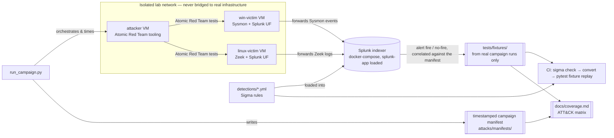

# Detection Lab

Projects 1-7 prove that real detections can be built from a static
network capture — hunt for a pattern, model it as a Sigma rule,
translate it to SPL, wire it up as a Splunk alert. What that whole
series can't do is tell you whether any of those detections actually
*work*: a static, one-time capture has no controlled ground truth, so
there's no way to compute a true-positive or false-positive rate for
any of the eight rules in `07-detection-as-code/`. This project exists
to close exactly that gap — provision an isolated lab, run known
attack techniques against it with Atomic Red Team, and measure whether
the ported detections actually catch what they claim to.

**Status: scaffolding only.** Nothing here has been provisioned, no
attack has been run, and `docs/coverage.md` and `tests/fixtures/`
reflect that honestly — every row and every fixture directory says so
explicitly rather than being left to look finished. See
[`../CLAUDE.md`](../CLAUDE.md) for the standing rules that apply to
this project and every other one in this repo.

## Why a separate directory, not a separate repo

This lab carries forward `splunk-app/` and all eight Sigma rules from
Project 7 as its literal starting point, not just a thematic one —
splitting it into its own repository would mean either duplicating
that detection logic or wiring up a submodule, neither of which is
worth it for what's fundamentally the next stage of the same story
this repo has been telling since Project 1.

## Architecture

## Structure

- **`lab/`** — `Vagrantfile` (VirtualBox: one Windows victim, one Linux
  victim, one attacker, all on a private host-only network) plus
  Ansible playbooks (Sysmon with the SwiftOnSecurity config on the
  Windows victim, Zeek and a Splunk Universal Forwarder on the Linux
  victim, Atomic Red Team's execution tooling on the attacker) and a
  `docker-compose.yml` for the Splunk indexer itself.
- **`splunk-app/`** — carried forward from Project 7's `splunk-app/`;
  see its own `README.md` here for what still needs to change to
  handle this lab's live Sysmon/Zeek data instead of the static replay
  sourcetypes.
- **`detections/`** — all eight Sigma rules ported from
  `07-detection-as-code/` as the starting set. ("Six Sigma rules" per
  this project's original scope note refers to the six detections
  *rows* in that project's table — the SSH detection alone is three
  correlated files, so porting fewer than all eight would break that
  correlation's dependency on its two component rules.)
- **`attacks/`** — `atomics.yml` (maps each rule to candidate Atomic
  Red Team tests) and `run_campaign.py` (orchestrates a campaign,
  writes a timestamped manifest; defaults to a dry run, refuses to
  execute anything real without an explicit risk acknowledgment).
- **`tests/`** — `fixtures/{true_positive,benign}/` (empty on purpose —
  see `tests/fixtures/README.md`) and `test_detections.py`, a
  lightweight local Sigma matcher used for CI fixture replay.
- **`.github/workflows/`** — `validate.yml` (`sigma check`),
  `convert.yml` (`sigma convert -t splunk`), `test.yml` (pytest
  fixture replay).
- **`docs/`** — `coverage.md` (ATT&CK technique → rule → tested →
  result matrix) and `findings/` (campaign writeups, populated once
  campaigns actually run).

## CI fidelity limitation

`test.yml`'s fixture replay does **not** run against a real Splunk
instance — there's no Splunk service container in this CI pipeline,
by design (spinning one up in GitHub Actions for every push would be
slow and still wouldn't have real forwarded lab data to search over).
Instead, `test_detections.py` is a small, self-contained Python matcher
that evaluates each rule's single-event `selection` criteria directly
against a JSON fixture. That's accurate for the simple selection rules
(the two scanner-signature rules, the injection-probe rule), but it
cannot evaluate aggregation conditions (`count()`, `dc()`, `avg()`
against a `timeframe`) or the correlation rule at all — those are
explicitly called out and only partially checked in the test file
itself. A green CI run confirms the ported rules are syntactically
valid and that simple selections match their fixtures; it is not a
substitute for actually measuring detection accuracy against a real
campaign, which is what stages 4-5 below exist to do.

## Build order

1. **Lab up** — `vagrant up` (provisions all three VMs via the Ansible
   playbooks in `lab/ansible/`), then `docker compose up` in `lab/`
   for the Splunk indexer. Confirm both victims' Universal Forwarders
   are actually delivering events before moving on.
2. **Port one detection** — start with `ssh-failed-login-threshold.yml`
   (the simplest single-event selection in the set) and confirm it
   fires against a manually-triggered event in the live lab before
   trying to scale to all eight at once.
3. **CI validate/convert** — get `validate.yml` and `convert.yml` green
   against the full ported rule set, same `sigma check` /
   `sigma convert -t splunk` pattern Project 7 already established.
4. **Capture ground truth from Atomic runs** — `attacks/run_campaign.py
   --execute --i-understand-the-risk` against the isolated lab
   (`run_test_live` needs to be wired up to your lab's actual
   WinRM/SSH remote-execution path first — it's a deliberate stub, see
   its docstring). Correlate which detections actually fired against
   which attacks actually ran, and save the results as real fixtures
   under `tests/fixtures/`.
5. **Test suite** — get `test.yml`'s fixture replay passing against
   those real fixtures, not synthetic ones.
6. **Scale to roughly 15 rules across DNS/process/auth** — once the
   full pipeline above is proven end-to-end on the eight-file starting
   set, expand `detections/` with new rules spanning process-creation
   (Sysmon) and authentication events the starting set doesn't cover.
7. **Campaign report** — write up what was actually measured
   (true/false-positive rates per rule) in `docs/findings/`, and update
   `docs/coverage.md` accordingly. This is the step the whole project
   exists to reach.

## Isolation warning

**Atomic Red Team executes real attack techniques.** Several tests
leave persistence behind — scheduled tasks, registry run keys, cron
entries, new local accounts — that are not automatically cleaned up.
Before running any campaign with `--execute`:

- Run only inside the isolated, host-only network the `Vagrantfile`
  sets up. Never add a bridged network adapter connecting the lab to
  your home network, corporate network, or the internet beyond what a
  specific test genuinely requires.
- **Snapshot every VM before a live run**, and restore from that
  snapshot afterward — don't rely on any individual test's own cleanup
  steps.
- Never run this lab adjacent to, or on the same host as, anything
  connected to real corporate infrastructure.

`run_campaign.py` requires both `--execute` and
`--i-understand-the-risk` together before it will touch a real host,
specifically to make an accidental live run harder — that's a safety
rail, not a formality to work around.
