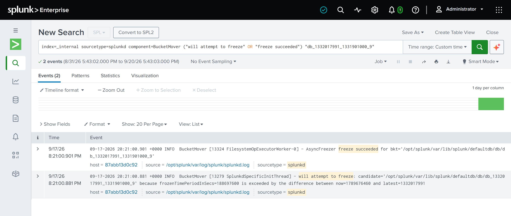

# splunk-app

A deployable Splunk app packaging the field extractions of Projects 1-6 and 8 and Project 7's detections as `.conf` files, instead of leaving them as GUI clicks and copy-pasted SPL. Ingestion still has to happen through **Settings → Add Data → Upload** (there's no way to script the actual file upload without a real Splunk instance to point at), but everything downstream of that - parsing, field extraction, alerting, CIM tagging - is defined here and versioned in this repo, not stored only inside a Splunk instance's own configuration.

## What's in here

- **`props.conf`** — per-sourcetype timestamp recognition (`TIME_PREFIX`/`TIME_FORMAT` for Zeek's epoch `ts` field), line-breaking fixes, null-queue routing for `#`-prefixed Zeek header/footer lines, and CIM field aliasing.
- **`transforms.conf`** — the field extractions themselves: delimiter-based (tab) field lists for all seven sourcetypes (`dns_sample`, `ftp_sample`, `ssh_sample`, `tunnel_sample`, `smtp_sample`, `dhcp_sample`, `http_sample`). `dns_sample`/`smtp_sample`/`dhcp_sample` were originally built as named-capture regexes (via the Interactive Field Extractor's Regex mode) and converted to `DELIMS` on 2026-09-18 — every column in every one of these logs is a fixed tab-separated position, not variable free text, so `DELIMS` is the simpler, more correct tool; field counts were re-verified against the real raw files before converting, not assumed from the old regex.
- **`savedsearches.conf`** — the nine Project 7 detections as saved-search definitions (three live scheduled alerts, six documented findings), generated from the Sigma rules in `07-detection-as-code/` and their hand-translated SPL. **Do not hand-edit this file** — see its header comment.
- **`eventtypes.conf`** / **`tags.conf`** — CIM data-model tagging for the three sourcetypes A5 scoped for it (DNS → Network Resolution, tunnel → Network Traffic, SSH → Authentication).
- **`indexes.conf`** — raises `main`'s retention (`frozenTimePeriodInSecs`) so a 2012 dataset doesn't age out of Splunk's default ~6-year window and get silently deleted. See "Known gotchas" below.
- **`../metadata/default.meta`** — declares this app's knowledge objects globally visible, not scoped to only this app's own search context. Required, not optional — see "Known gotchas" below.
- **`../tools/lint_repo.py`** — not part of the deployable app: a stdlib-only check, run in CI, that fails the build if any stanza here loses a setting this README calls required (timestamps, `MAX_DAYS_AGO`, line-breaking, retention, the global export), if a field list drifts from the raw log's real column count, or if an alert stops pinning `index=main` / a relative window, or uses a conf key that `splunk btool check` rejects (`is_scheduled` and an empty `actions =` were removed on 2026-09-21 for exactly that reason; `enableSched` is the real scheduling switch).

## Install

1. Copy this `splunk-app/` directory into your Splunk instance's `$SPLUNK_HOME/etc/apps/` directory (rename the top-level folder to something like `splunk_log_analysis_labs` if you want a specific app name — Splunk uses the directory name as the app's internal ID). Bring the `metadata/default.meta` file along, not just `default/` — see "Known gotchas" below for why it's required, not optional.
2. Restart Splunk, or run `splunk restart`, to pick up the new `.conf` files.
3. Ingest each of the seven raw logs via **Settings → Add Data → Upload**, setting the sourcetype explicitly to match one of the stanzas in `props.conf` (`dns_sample`, `ftp_sample`, `ssh_sample`, `tunnel_sample`, `smtp_sample`, `dhcp_sample`, `http_sample`) at upload time.
   - **Note on the FTP sourcetype specifically:** Project 2's original ingestion hit a bug where Splunk's classic upload wizard silently overrode the custom `ftp_sample` name with a built-in sourcetype, `ftp.logs` (see `02-ftp-log-analysis/README.md`, Bug #1). That override happens in the interactive wizard's own matching logic; it shouldn't recur here as long as `props.conf`'s `[ftp_sample]` stanza is already deployed and active *before* upload, since Splunk checks for a matching configured sourcetype first. Confirm under **Settings → Sourcetypes** after upload regardless, per this repo's own standing practice since that bug was found. (Ingesting via `splunk add oneshot -sourcetype ftp_sample` instead of the GUI wizard sidesteps this bug entirely, since the override lives in the wizard's own matching logic, not the sourcetype/index-time pipeline.)
4. Verify each sourcetype landed correctly and with the expected event count, and that `_time` now reflects the real 2012 capture time rather than ingestion time (the fix this whole app exists to apply — see the `props.conf` header comment).
5. Re-run the DHCP verification step in `RUNBOOK.md` to confirm the line-breaking fix actually corrects the undercount documented in Project 6 (expect the true top host's 744-of-1,502 request count to now be visible, not the buggy 41-of-333 view).
6. Wait at least a few minutes after ingestion, then re-check the event counts once more before trusting them — see "Silent retention deletion" below.

## Known gotchas (found deploying this app for real, 2026-09-18)

- **Silent retention deletion.** Splunk's default `frozenTimePeriodInSecs` is ~6 years, and with no `coldToFrozenDir` configured, anything older gets *deleted*, not archived, the next time the indexer's periodic freeze check runs — not just excluded from search. This capture is a 2012 dataset; by 2026 it's well past that window. `indexes.conf` in this app raises `frozenTimePeriodInSecs` on `main` to effectively unlimited, but that only prevents *future* deletion — if you're restoring from a fresh Splunk instance, deploy this app (indexes.conf included) **before** ingesting, not after, or the first freeze sweep may delete your data within minutes of a successful ingest looking correct. Splunk's own log records it happening: `BucketMover - will attempt to freeze: candidate='.../db_1332017991_1331901000_9' because frozenTimePeriodInSecs=188697600 is exceeded ...`, followed by `AsyncFreezer freeze succeeded for bkt=...` — and that bucket name is this capture's exact time range (newest event 1332017991, oldest 1331901000).

  
- **This app's own metadata must export globally.** Without `metadata/default.meta` declaring `export = system`, this app's `FIELDALIAS`/`REPORT`/`EXTRACT` directives are only visible to searches run *from this app's own namespace* — a search from Splunk's default "search" app (which is where the REST API and the normal search bar both run by default) silently sees none of them and returns empty results for any field they were supposed to produce, with no error anywhere. Index-time settings (`TIME_PREFIX`, `LINE_BREAKER`) aren't affected by this — they apply globally regardless of app context, since indexing has no "current app" — which is what made this confusing to diagnose: half the fix appeared to work and half silently didn't. **Verified by A/B test (2026-09-19):** with the file removed and Splunk restarted, `dest`/`src` returned 0 on `dns_sample`, `ssh_sample` and `smtp_sample`, and `http_sample` — whose extraction lives only in this app — lost `src_ip` entirely; restoring the file brought everything back.
- **`MAX_DAYS_AGO` is measured from the file's modification time, not today's date.** This is what broke `tunnel_sample`'s timestamps, and why the 2012 MACCDC logs happened to work without it. Splunk's default is 2000 days, measured from the input layer's "current date" — for a file, its modtime (`props.conf.spec`). The MACCDC logs carry 2014 modtimes, so 2012 passes; `tunnel.log` was generated locally in 2026, so its 2008/2012 timestamps were rejected and every event fell back to the file's modtime (`2026-08-28 22:39:33` — exactly the `_time` its events got). **Proven by experiment:** ingesting the same file into a scratch sourcetype with `MAX_DAYS_AGO = 10951` produced 8 events with their real timestamps (2008-05-16 to 2012-03-05); the same result was then confirmed on the real `tunnel_sample` sourcetype once its stale events were cleared. Every stanza here now sets it, so a freshly downloaded copy of any of these logs can't hit the same failure. *Correction to this repo's earlier documentation:* this was first written up as an unexplained platform quirk after "three independent fixes" failed — but two of those attempts put `INGEST_EVAL` in `props.conf`, where Splunk doesn't read it (it is a `transforms.conf` setting), so they never tested what they claimed. `tools/lint_repo.py` now fails the build on that mistake.
- **A lone `earliest=0` is ignored by Splunk Web, so pasted queries silently return nothing.** Found 2026-09-21 by running the docs' own queries in Search & Reporting. With the default "Last 24 hours" time picker, `index=main earliest=0 | stats count by sourcetype` returned 0 results in the web UI (window stayed at the picker's range) even though the same text over the REST API returned all 2,490,943 events. State both bounds - `earliest=0 latest=now` - or set the picker to All time. Every documented query now does, and `tools/lint_repo.py` enforces it. This is a search-time usage rule for this 2012 dataset, independent of the index-time settings above.

## Why the schema differs from modern Zeek

Every regex in `transforms.conf` is tied to this specific dataset's Zeek/Bro version, not to Zeek's current schema — and that's deliberate, not an oversight. The MACCDC 2012 capture predates several schema changes in later Zeek releases:

- **`dns.log`** here is 23 fields, not the 24-field schema a current Zeek installation produces — this 2012-era capture has no `rtt` (round-trip time) column, which was added later. Every field after `trans_id` sits one position earlier than it would in a modern log (see `01-dns-log-analysis/README.md` for the exact bug this caused when a modern-schema regex was tried first).
- **`smtp.log`** here is 25 fields; a current Zeek release adds `second_received` and `tls` fields on top of this.
- **`dhcp.log`** here uses the older Bro-era 10-field schema (`ts, uid, id.orig_h, id.orig_p, id.resp_h, id.resp_p, mac, assigned_ip, lease_time, trans_id`) rather than the substantially different, richer DHCP transaction schema modern Zeek produces.
- **`http.log`** here is 27 fields, matching Bro 2.x's schema (`..., filename, tags, username, password, proxied, orig_fuids, orig_mime_types, resp_fuids, resp_mime_types`) — confirmed against real data, not just field count: `tags` (a set-type field) shows Bro's own `(empty)` convention on ordinary requests and real signature hits like `HTTP::URI_SQLI` on attack traffic, and `resp_fuids`/`resp_mime_types` show real file UIDs paired with real MIME types only on responses that actually carried a body.

The general lesson, carried over from Project 1's own writeup: never assume a log's field schema from current documentation or a generic template — confirm it against the source file's own header (or, when there is no header, against multiple raw sample rows) before building a parser. A wrong field mapping doesn't error out loudly here; it silently produces empty or misaligned results, which is a worse failure mode than an outright crash. If this app is ever pointed at a newer Zeek deployment's logs instead of this archival capture, every regex in `transforms.conf` needs to be re-verified against that version's actual schema first, not assumed to still apply.

## New dependencies

This app assumes the `url_toolbox` Splunk app is installed for the `ut_shannon` macro used in the DNS tunneling investigation (`01-dns-log-analysis/investigation/INVESTIGATION.md`) — install it separately from Splunkbase, or side-load it if this instance has no internet access. `sigma-cli` and `pysigma-backend-splunk` are Python packages used by CI (`.github/workflows/validate.yml`) to lint and convert the Sigma rules in `07-detection-as-code/`, not by the Splunk instance itself.
